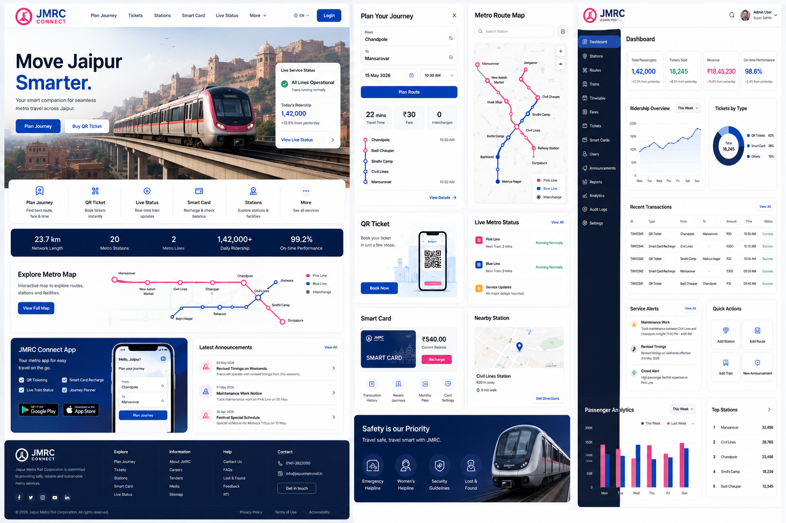

<h1 align="center">🚇 JMRC Connect</h1>

<p align="center">
  
</p>

<p align="center">
A premium Smart Metro Platform inspired by Jaipur Metro Rail Corporation, designed to deliver a modern passenger-first digital experience through intelligent journey planning, smart card services, digital ticketing, complaint management, tourist assistance, and enterprise administration.
</p>

<p align="center">


</p>

---

# 🚇 Overview

JMRC Connect is a modern Smart Metro Platform that reimagines how passengers interact with public transportation.

Instead of a traditional government portal, the platform delivers a premium digital experience focused on usability, accessibility, responsive design, and scalable application architecture.

It brings together intelligent journey planning, smart card services, QR ticketing, passenger support, metro station discovery, tourism assistance, and enterprise administration into one unified platform.

The project demonstrates production-oriented frontend engineering, modular architecture, reusable component systems, service/repository abstraction, authentication, and enterprise UI design.

---

# ✨ Core Features

### 🚉 Journey Planning

- Intelligent Route Planner
- Fare Estimation
- Route Visualization
- Travel Duration
- Saved Routes
- Favorite Stations

---

### 🎫 Digital Ticketing

- QR Ticket Booking
- Ticket History
- Journey Summary
- Ticket Cancellation
- Payment Tracking

---

### 💳 Smart Card

- Virtual Smart Card
- Recharge Workflow
- Transaction History
- Recharge Analytics
- Balance Management
- Auto Recharge

---

### 🗺️ Metro Explorer

- Station Directory
- Interactive Metro Map
- Platform Information
- Accessibility
- Parking
- Facilities
- Metro Timings

---

### 🏛️ Tourist Guide

- Nearby Attractions
- Metro Connectivity
- Smart Navigation
- Popular Destinations

---

### 🚨 Passenger Services

- Complaint Registration
- Complaint Tracking
- Notifications
- Announcements
- Emergency Contacts
- Lost & Found

---

### 👤 Passenger Dashboard

- Personalized Dashboard
- Smart Card Overview
- Travel Analytics
- Recent Payments
- Notifications
- Favorite Stations

---

### 👨‍💼 Admin Portal

- Passenger Management
- Complaint Resolution
- Dashboard Analytics
- Smart Card Monitoring
- Reports
- Announcements
- Notification Center

---

# 📱 Responsive Experience

Dedicated interfaces have been designed for every screen size.

### Desktop

- Enterprise dashboard
- Sidebar navigation
- Multi-column layouts
- Advanced analytics

### Laptop

- Optimized spacing
- Compact dashboard
- Information-dense layouts

### Tablet

- Collapsible sidebar
- Touch-optimized UI
- Two-column layouts

### Mobile

- Native app-inspired interface
- Bottom navigation
- Full-screen booking flow
- Swipe interactions
- Thumb-friendly navigation

---

# 🏗️ Architecture

```text
Passenger / Admin

        │

React 19 + TypeScript

        │

Feature Modules

        │

Shared UI Components

        │

Service Layer

        │

Repository Layer

        │

Supabase Backend

        │

PostgreSQL

Future Ready

↓

Express + MongoDB
```

---

# ⚙️ Technology Stack

### Frontend

- React 19
- TypeScript
- Vite
- Tailwind CSS v4
- React Router
- TanStack Query
- React Hook Form
- Zod
- Axios

### UI & Experience

- shadcn/ui
- Framer Motion
- Lucide React
- Recharts

### Backend

- Supabase
- PostgreSQL
- Authentication
- Row Level Security

### Architecture

- Service Layer
- Repository Pattern
- Feature-Based Architecture
- Modular Components

---

# 🎨 Design System

- Enterprise UI
- Inter Typography
- 8px Spacing System
- Responsive Grid
- White Surfaces
- Graphite Navigation
- JMRC Brand Accent
- Soft Shadows
- Premium Motion Design
- Accessible Components

---

# 📊 Engineering Highlights

- Feature-Based Architecture
- Repository Pattern
- Service Layer
- Protected Routes
- Authentication
- Responsive UI
- Reusable Components
- Lazy Loading
- Type Safety
- Modular Codebase
- Accessibility
- Modern Dashboard Design

---

# 📈 Feature Matrix

| Feature | Passenger | Admin |
|----------|:---------:|:-----:|
| Authentication | ✅ | ✅ |
| Journey Planner | ✅ | — |
| Smart Card | ✅ | Manage |
| QR Ticket | ✅ | Manage |
| Recharge | ✅ | Monitor |
| Complaints | ✅ | Resolve |
| Notifications | ✅ | Send |
| Dashboard | ✅ | ✅ |
| Analytics | — | ✅ |

---

# 🚀 Roadmap

- Live Train Tracking
- AI Journey Recommendations
- Push Notifications
- Offline Support (PWA)
- Multi-language Support
- Wallet Integration
- Express + MongoDB Migration
- Docker Deployment
- CI/CD Pipeline

---

> **Note:** This repository serves as a portfolio showcase of a private project. Certain implementation details, deployment configuration, and production assets may be omitted or simplified.
